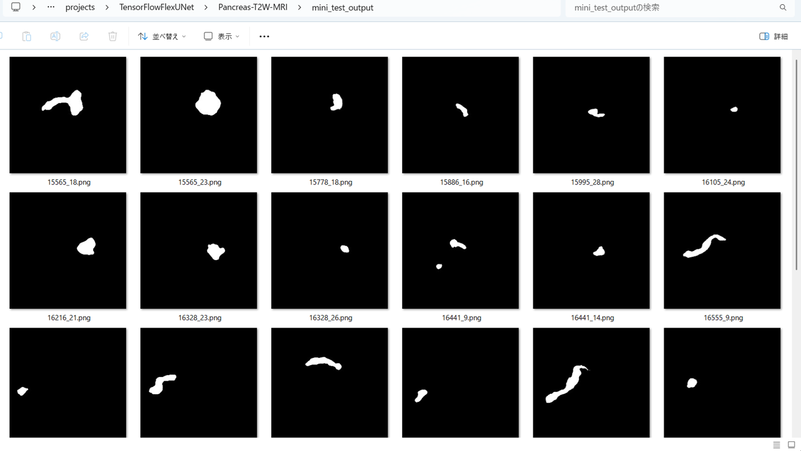

<h2>TensorFlow-FlexUNet-Image-Segmentation-Pancreas-T2W-MRI (2025/09/15)</h2>

This is the first experiment of Image Segmentation for Pancreas-T2W-MRI based on 
our <a href="./src/TensorFlowFlexUNet.py">TensorFlowFlexUNet</a>
 (<b>TensorFlow Flexible UNet Image Segmentation Model for Multiclass</b>)
 and a 512x512 pixels PNG
<a href="https://drive.google.com/file/d/1U52wgUwfnaQvQuoKi2cW3jY-3zM-fqXs/view?usp=sharing">
Pancreas-T2W-MRI-PNG-ImageMask-Dataset.zip
</a>, <a href="https://drive.google.com/file/d/12gCJLIhqOG52-VpOWxYG14r54KR66CiT/view?usp=sharing">Pancreas-T2-ImageMaskDataset-V1.zip</a>, 
which is a subset of T2W (t2.zip) in the original Pancreas_MRI_Dataset of OSF Storage <a href="https://osf.io/kysnj/">
<b>PanSegData.</b></a> 
On detail of the Pancreas-T2-ImageMaskDataset, please refer to
 <a href="https://github.com/sarah-antillia/ImageMask-Dataset-Pancreas-T2">ImageMask-Dataset-Pancreas-T2</a>
 
 
Please see also our singleclass segmentation model
<a href="https://github.com/sarah-antillia/Tensorflow-Image-Segmentation-Pancreas-T2W-MRI">
Tensorflow-Image-Segmentation-Pancreas-T2W-MRI
</a>
 
 
As demonstrated in <a href="https://github.com/sarah-antillia/TensorFlow-FlexUNet-Image-Segmentation-STARE-Retinal-Vessel">
TensorFlow-FlexUNet-Image-Segmentation-STARE-Retinal-Vessel</a> ,
 our Multiclass TensorFlowFlexUNet, which uses categorized masks, can also be applied to 
single-class image segmentation models. 
This is because it inherently treats the background as one category and your single-class mask data as 
a second category. In essence, your single-class segmentation model will operate with two categorized classes within our Multiclass UNet framework.
 
 

<b>Actual Image Segmentation for Images of 512x512 pixels</b> 
As shown below, the inferred masks predicted by our segmentation model trained on the 
PNG dataset appear similar to the ground truth masks. 
<table>
<tr>
<th>Input: image</th>
<th>Mask (ground_truth)</th>
<th>Prediction: inferred_mask</th>
</tr>
<tr>
<td></td>
<td></td>
<td></td>
</tr>

<tr>
<td></td>
<td></td>
<td></td>
</tr>

<tr>
<td></td>
<td></td>
<td></td>
</tr>
</table>

 

<h3>1 Dataset Citation</h3>
The dataset used here was obtained from OSF HOME <a href="https://osf.io/kysnj/"><b>PanSegData</b></a> 
Contributors: Ulas Bagci Debesh Jha Zheyuan Zhang Elif Keles 
Date created: 2024-04-28 02:14 PM | Last Updated: 2024-07-08 11:41 PM 
Identifier: DOI 10.17605/OSF.IO/KYSNJ 
Category:  Data 
Description: <i>The dataset consists of 767 MRI scans (385 TIW) and 382 T2W scans from five 
different institutions.</i> 
License: <i>GNU General Public License (GPL) 3.0</i>  
 
<h3>
2 Pancreas-T2W-MRI ImageMask Dataset
</h3>
 If you would like to train this Pancreas-T2W-MRI Segmentation model by yourself,
 please download the dataset from the google drive  
<a href="https://drive.google.com/file/d/1U52wgUwfnaQvQuoKi2cW3jY-3zM-fqXs/view?usp=sharing">
Pancreas-T2W-MRI-PNG-ImageMask-Dataset.zip</a>,
, expand the downloaded ImageMaskDataset and put it under <b>./dataset</b> folder to be
<pre>
./dataset
└─Pancreas-T2W-MRI
    ├─test
    │   ├─images
    │   └─masks
    ├─train
    │   ├─images
    │   └─masks
    └─valid
        ├─images
        └─masks
</pre>
 
On the derivation of this dataset, please refer to our repository
<a href="https://github.com/sarah-antillia/ImageMask-Dataset-Pancreas-T2">
 ImageMask-Dataset-Pancreas-T2
 </a>
  
<b>Pancreas-T2W-MRI Statistics</b> 
 
 
As shown above, the number of images of train and valid datasets is large enough to use for a training set of our segmentation model.
 
 
<b>Train_images_sample</b> 

 
<b>Train_masks_sample</b> 

 

<h3>
3 Train TensorFlowUNet Model
</h3>
 We have trained Pancreas-T2W-MRITensorFlowUNet Model by using the following
<a href="./projects/TensorFlowFlexUNet/Pancreas-T2W-MRI/train_eval_infer.config"> <b>train_eval_infer.config</b></a> file.  
Please move to ./projects/TensorFlowFlexUNet/Pancreas-T2W-MRIand run the following bat file. 
<pre>
>1.train.bat
</pre>
, which simply runs the following command. 
<pre>
>python ../../../src/TensorFlowUNetTrainer.py ./train_eval_infer.config
</pre>

<b>Model parameters</b> 
Defined a small <b>base_filters = 16</b> and large <b>base_kernels = (9,9)</b> for the first Conv Layer of Encoder Block of 
<a href="./src/TensorFlowUNet.py">TensorFlowUNet.py</a> 
and a large num_layers (including a bridge between Encoder and Decoder Blocks).
<pre>
[model]
image_width    = 512
image_height   = 512
image_channels = 3

num_classes    = 2

base_filters   = 16
base_kernels   = (9,9)
num_layers     = 8
dropout_rate   = 0.04
dilation       = (1,1)

</pre>

<b>Learning rate</b> 
Defined a small learning rate.  
<pre>
[model]
learning_rate  = 0.00007
</pre>

<b>Online augmentation</b> 
Disabled our online augmentation.  
<pre>
[model]
model         = "TensorFlowUNet"
generator     = False
</pre>

<b>Loss and metrics functions</b> 
Specified "categorical_crossentropy" and <a href="./src/dice_coef_multiclass.py">"dice_coef_multiclass"</a>. 
<pre>
[model]
loss           = "categorical_crossentropy"
metrics        = ["dice_coef_multiclass"]
</pre>
<b>Learning rate reducer callback</b> 
Enabled learing_rate_reducer callback, and a small reducer_patience.
<pre> 
[train]
learning_rate_reducer = True
reducer_factor     = 0.5
reducer_patience   = 4
</pre>

<b>Early stopping callback</b> 
Enabled early stopping callback with patience parameter.
<pre>
[train]
patience      = 10
</pre>

<b>RGB Color map</b> 
rgb color map dict for Pancreas-T2W-MRI 1+1 classes.
<pre>
[mask]
mask_datatype    = "categorized"
mask_file_format = ".png"

;     Background   Pancreas-T2W-MRI: white 
rgb_map = {(0,0,0):0,(255, 255, 255):1,}
</pre>

<b>Epoch change inference callback</b> 
Enabled <a href="./src/EpochChangeInferencer.py">epoch_change_infer callback (EpochChangeInferencer.py)</a></b>. 
<pre>
[train]
epoch_change_infer       = True
epoch_change_infer_dir   =  "./epoch_change_infer"
num_infer_images         = 6
</pre>

By using this callback, on every epoch_change, the inference procedure can be called
 for 6 images in <b>mini_test</b> folder. This will help you confirm how the predicted mask changes 
 at each epoch during your training process.    

<b>Epoch_change_inference output at starting (epoch 1,2,3)</b> 
 
 
<b>Epoch_change_inference output at middlepoint (epoch 18,19,20)</b> 
 
 

<b>Epoch_change_inference output at ending (epoch 37,38,39)</b> 
 
 

In this experiment, the training process was stopped at epoch 39 by EarlyStoppingCallback.  
 
 

<a href="./projects/TensorFlowFlexUNet/Pancreas-T2W-MRI/eval/train_metrics.csv">train_metrics.csv</a> 
 

 
<a href="./projects/TensorFlowFlexUNet/Pancreas-T2W-MRI/eval/train_losses.csv">train_losses.csv</a> 
 

 

<h3>
4 Evaluation
</h3>
Please move to a <b>./projects/TensorFlowFlexUNet/Pancreas-T2W-MRI</b> folder, 
and run the following bat file to evaluate TensorFlowUNet model for Pancreas-T2W-MRI. 
<pre>
./2.evaluate.bat
</pre>
This bat file simply runs the following command.
<pre>
python ../../../src/TensorFlowUNetEvaluator.py ./train_eval_infer_aug.config
</pre>

Evaluation console output: 

  Image-Segmentation-Pancreas-T2W-MRI

<a href="./projects/TensorFlowFlexUNet/Pancreas-T2W-MRI/evaluation.csv">evaluation.csv</a> 

The loss (bce_dice_loss) to this Pancreas-T2W-MRI/test was very low, but dice_coef very high as shown below.
 
<pre>
categorical_crossentropy,0.0043
dice_coef_multiclass,0.9977
</pre>
 
<h3>
5 Inference
</h3>
Please move to a <b>./projects/TensorFlowFlexUNet/Pancreas-T2W-MRI</b> folder 
,and run the following bat file to infer segmentation regions for images by the Trained-TensorFlowUNet model for Pancreas-T2W-MRI. 
<pre>
./3.infer.bat
</pre>
This simply runs the following command.
<pre>
python ../../../src/TensorFlowUNetInferencer.py ./train_eval_infer_aug.config
</pre>

<b>mini_test_images</b> 
 
<b>mini_test_mask(ground_truth)</b> 
 

<b>Inferred test masks</b> 
 
 

<b>Enlarged images and masks </b> 

<table>
<tr>
<th>Image</th>
<th>Mask (ground_truth)</th>
<th>Inferred-mask</th>
</tr>
<tr>
<td></td>
<td></td>
<td></td>
</tr>

<tr>
<td></td>
<td></td>
<td></td>
</tr>

<tr>
<td></td>
<td></td>
<td></td>
</tr>

<tr>
<td></td>
<td></td>
<td></td>
</tr>

<tr>
<td></td>
<td></td>
<td></td>
</tr>

<tr>
<td></td>
<td></td>
<td></td>
</tr>

</table>

 

<h3>
References
</h3>
<b>1. Large-Scale Multi-Center CT and MRI Segmentation of Pancreas with Deep Learning </b> 
 Zheyuan Zhanga, Elif Kelesa, Gorkem Duraka, Yavuz Taktakb, Onkar Susladkara, Vandan Goradea, Debesh Jhaa,  
 Asli C. Ormecib, Alpay Medetalibeyoglua, Lanhong Yaoa, Bin Wanga, Ilkin Sevgi Islera, Linkai Penga,  
 Hongyi Pana, Camila Lopes Vendramia, Amir Bourhania, Yury Velichkoa, Boqing Gongd, Concetto Spampinatoe,  
 Ayis Pyrrosf, Pallavi Tiwarig, Derk C F Klatteh, Megan Engelsh, Sanne Hoogenboomh, Candice W. Bolani,  
 Emil Agarunovj, Nassier Harfouchk, Chenchan Huangk, Marco J Brunol, Ivo Schootsm, Rajesh N Keswanin,  
 Frank H Millera, Tamas Gondaj, Cemal Yazicio, Temel Tirkesp, Baris Turkbeyq, Michael B Wallacer, Ulas Bagcia, 

<a href="https://arxiv.org/pdf/2405.12367">https://arxiv.org/pdf/2405.12367</a>
 
<a href="https://github.com/NUBagciLab/PANSegNet">Large-Scale Multi-Center CT and MRI Segmentation of Pancreas with Deep Learning</a>
 
 
<b>2. Pancreas Segmentation in MRI using Graph-Based Decision Fusion on Convolutional Neural Networks</b> 
Jinzheng Cai, Le Lu, Zizhao Zhang, Fuyong Xing, Lin Yang, Qian Yin
 
<a href="https://pmc.ncbi.nlm.nih.gov/articles/PMC5223591/">https://pmc.ncbi.nlm.nih.gov/articles/PMC5223591/</a>
 
 
<b>3. ImageMask-Dataset-Pancreas-T2</b> 
Toshiyuki Arai @antillia.com 
<a href="https://github.com/sarah-antillia/ImageMask-Dataset-Pancreas-T2">https://github.com/sarah-antillia/ImageMask-Dataset-Pancreas-T2
</a>
 
 
<b>4. Tensorflow-Image-Segmentation-Pancreas-T2W-MRI</b> 
Toshiyuki Arai @antillia.com  
<a href="https://github.com/sarah-antillia/Tensorflow-Image-Segmentation-Pancreas-T2W-MRI">
https://github.com/sarah-antillia/Tensorflow-Image-Segmentation-Pancreas-T2W-MRI
</a>

